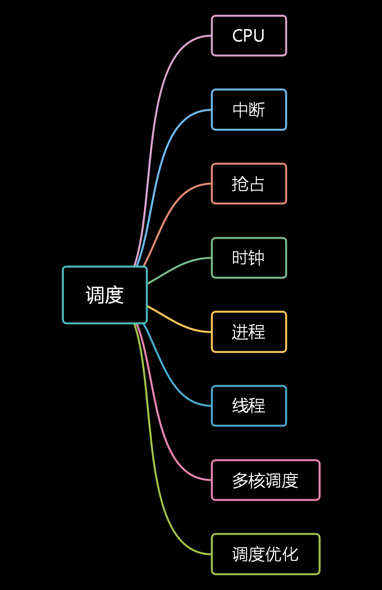
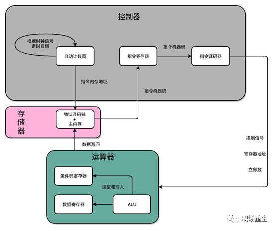
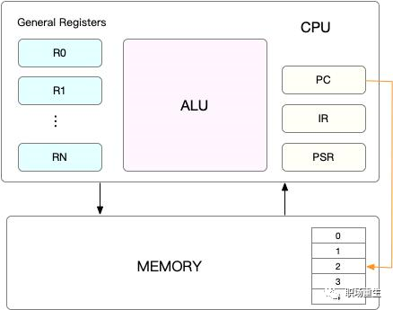
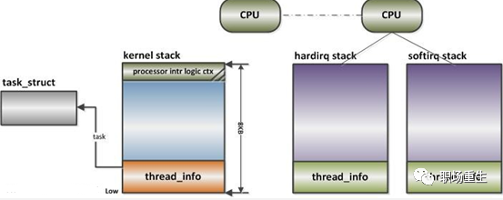
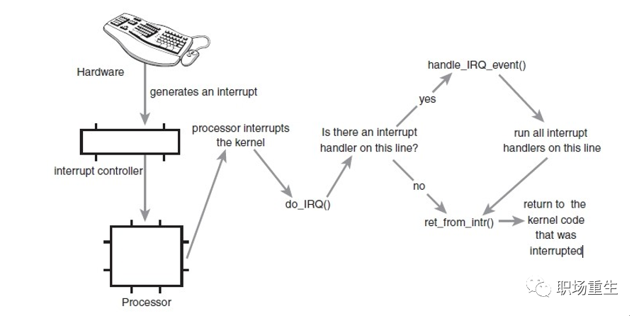
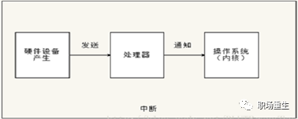
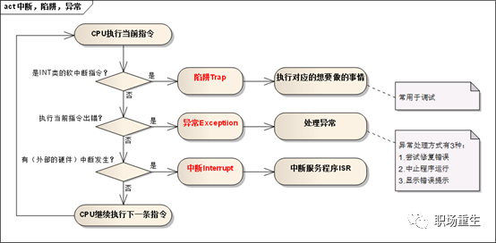
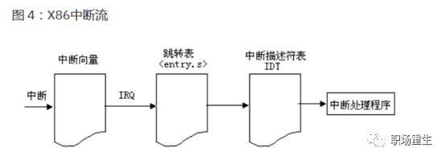
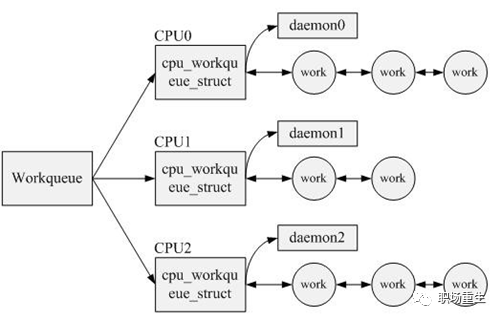
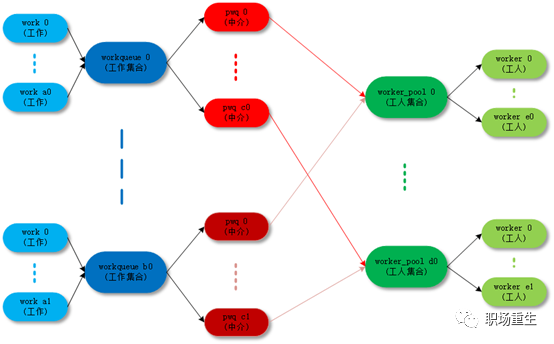

点击上方蓝字关注公众号，更多经典内容等着你

  

| 导语 本文主要是讲Linux的调度系统, 由于全部内容太多，分三部分来讲，调度可以说是操作系统的灵魂，为了让CPU资源利用最大化，Linux设计了一套非常精细的调度系统，对大多数场景都进行了很多优化，系统扩展性强，我们可以根据业务模型和业务场景的特点，有针对性的去进行性能优化，在保证客户网络带宽前提下，隔离客户互相之间的干扰影响，提高CPU利用率，降低单位运算成本，提高市场竞争力。欢迎大家相互交流学习！

                              **目录**




CPU作为计算资源，一直是云计算厂商比拼的核心竞争力，我们的目标是合理安排好计算任务，充分提高CPU的利用率，预留更多空间容错，增强系统稳定性，让任务更快执行，降低无效功耗，节约成本，从而提高市场竞争力。  



                               CPU 实现的抽象逻辑图

1.  首先，我们有一个自动计数器。这个自动计数器会随着时钟主频不断地自增，来作为我们的 PC 寄存器；
    
2.  在这个自动计数器的后面，我们连上一个译码器。译码器还要同时连着我们通过大量的 D 触发器组成的内存。
    
3.  自动计数器会随着时钟主频不断自增，从译码器当中，找到对应的计数器所表示的内存地址，然后读取出里面的 CPU 指令。
    
4.  读取出来的 CPU 指令会通过CPU 时钟的控制，写入到一个由 D 触发器组成的寄存器，也就是指令寄存器当中。
    
5.  在指令寄存器后面，我们可以再跟一个译码器。这个译码器的作用不再是用于寻址，而是把拿到的指令解析成opcode 和对应的操作数。
    
6.  当我们拿到对应的 opcode 和操作数，对应的输出线路就要连接 ALU，开始进行各种算术和逻辑运算。对应的计算结果，则会再写回到 D 触发器组成的寄存器或者内存当中。
    

这里整个过程就大概是CPU的一条指令的执行过程。为了加快CPU指令的执行速度，CPU在发展过程中做了很多优化，例如流水线，分支预测，超标量，Hyper-threading，SIMD，多级cache，NUMA架构等,  这里主要关注Linux的调度系统。

**CPU上下文**

Linux 是一个多任务操作系统，它支持远大于 CPU 数量的任务同时运行。当然，这些任务实际上并不是真的在同时运行，而是因为系统在很短的时间内，将 CPU 轮流分配给它们，造成多任务同时运行的错觉。

而在每个任务运行前，CPU 都需要知道任务从哪里加载、又从哪里开始运行，也就是说，需要系统事先帮它设置好 CPU 寄存器和程序计数器(Program Counter，PC)。

CPU 寄存器，是 CPU 内置的容量小、但速度极快的内存。而程序计数器，则是用来存储 CPU 正在执行的指令位置、或者即将执行的下一条指令位置。它们都是 CPU 在运行任何任务前，必须的依赖环境，因此也被叫做 CPU 上下文（执行环境）：



而这些保存下来的上下文，会存储在系统内核中（堆栈），并在任务重新调度执行时再次加载进来。这样就能保证任务原来的状态不受影响，让任务看起来还是连续运行。

在Linux中，内核空间和用户空间是两种工作模式，操作系统运行在内核空间，而用户态应用程序运行在用户空间，它们代表不同的级别，而对系统资源具有不同的访问权限。

这样代码（指令）执行存在不同的CPU上下文，而进行调度的时候，要进行相应的CPU上下文切换，Linux系统存在不同堆栈来保存CPU上下文，系统中每个进程都会拥有属于自己的内核栈，而系统中每个CPU都将为中断处理准备了两个独立的中断栈，分别是hardirq栈和softirq栈：



Linux系统调用CPU上下文切换堆栈结构：


-   中断上下文：中断代码运行于内核空间，中断上下文即运行中断代码所需要的CPU上下文环境，需要硬件传递过来的这些参数，内核需要保存的一些其他环境（主要是当前被打断执行的进程或其他中断环境），这些一般都保存在中断栈中（x86是独立的，其他可能和内核栈共享，这和具体处理架构密切相关），在中断结束后，进程仍然可以从原来的状态恢复运行。
    
-   进程上下文：进程是由内核来管理和调度的，进程的切换发生在内核态，进程的上下文不仅包括了虚拟内存、栈、全局变量等用户空间的资源，还包括了内核堆栈、寄存器等内核空间的状态。
    
-   系统调用上下文：进程可以在内核空间和用户空间运行，分别称为进程的用户态和进程的内核态, 从用户态到内核态的转变需要通过系统调用来完成，需要进行CPU上下文切换，在执行系统调用时候，需要保存用户态的CPU上下文（用户态堆栈）到内核堆栈，然后加载内核态的CPU上下文。
    
-   CPU处理器总处于以下状态中的一种：  
    １、内核态，运行于进程上下文，内核代表进程运行于内核空间；  
    ２、内核态，运行于中断上下文，内核代表硬件运行于内核空间；  
    ３、用户态，运行于用户空间。  
    

##                                  **中断**


中断是由硬件设备产生的，而它们从物理上说就是电信号，之后，它们通过中断控制器发送给CPU，接着CPU判断收到的中断来自于哪个硬件设备（这定义在内核中），最后，由CPU发送给内核，内核来处理中断。



硬中断简单处理流程：  




硬中断实现：中断控制器+中断服务程序

中断框架设计(x86)：


X86计算机的 CPU 为中断只提供了两条外接引脚：NMI 和 INTR。其中 NMI 是不可屏蔽中断，它通常用于电源掉电和物理存储器奇偶校验；INTR是可屏蔽中断，可以通过设置中断屏蔽位来进行中断屏蔽，它主要用于接受外部硬件的中断信号，这些信号由中断控制器传递给 CPU。当前x86 SMP架构主流都是采用多级I/O APIC（高级可编程中断控制器）中断系统。

Local APIC：主要负责传递中断信号到指定的处理器；

I/O APIC：主要是收集来自 I/O 装置的 Interrupt 信号且在当那些装置需要中断时发送信号到本地 APIC；

**中断分类**：

中断可分为同步（_synchronous_）中断和异步（_asynchronous_）中断：

-   同步中断是当指令执行时由 CPU 控制单元主动产生，之所以称为同步，是因为只有在一条指令执行完毕后 CPU 才会发出中断，而不是发生在代码指令执行期间，比如系统调用，根据 Intel 官方资料，同步中断称为异常（_exception_），异常可分为故障（_fault_）、陷阱（_trap_）、终止（_abort_）三类。
    
-   异步中断是指由其他硬件设备依照 CPU 时钟信号随机产生，即意味着中断能够在指令之间发生，例如键盘中断，异步中断被称为中断（_interrupt_），中断可分为可屏蔽中断（_Maskable interrupt_）和非屏蔽中断（_Nomaskable interrupt_）。
    

1.  非屏蔽中断(Non-maskable interrupts,即NMI）：就像这种中断类型的字面意思一样，这种中断是不可能被CPU忽略或取消的。NMI是在单独的中断线路上进行发送的，它通常被用于关键性硬件发生的错误，如内存错误，风扇故障，温度传感器故障等。
    
2.  可屏蔽中断（Maskable interrupts）：这些中断是可以被CPU忽略或延迟处理的。当缓存控制器的外部针脚被触发的时候就会产生这种类型的中断，而中断屏蔽寄存器就会将这样的中断屏蔽掉。我们可以将一个比特位设置为0，来禁用在此针脚触发的中断。
    

处理流程：



区别：


相同点：

1.最后都是由CPU发送给内核，由内核去处理；

2.处理程序的流程设计上是相似的。

不同点：

1.产生源不相同，陷阱、异常是由CPU产生的，而中断是由硬件设备产生的；

2.内核需要根据是异常，陷阱，还是中断调用不同的处理程序；

3.中断不是时钟同步的，这意味着中断可能随时到来；陷阱、异常是CPU产生的，所以，它是时钟同步的；

4.当处理中断时，处于中断上下文中；处理陷阱、异常时，处于进程上下文中。

**中断亲和：**

-   在 SMP 体系结构中，我们可以通过系统调用和一组相关的宏来设置 CPU 亲和力（CPU affinity），将一个或多个进程绑定到一个或多个处理器上运行。中断在这方面也毫不示弱，也具有相同的特性。中断亲和力是指将一个或多个中断源绑定到特定的 CPU 上运行；
    
-   在 /proc/irq 目录中，对于已经注册中断处理程序的硬件设备，都会在该目录下存在一个以该中断号命名的目录 IRQ# ，IRQ# 目录下有一个 smp\_affinity 文件（SMP 体系结构才有该文件），它是一个 CPU 的位掩码，可以用来设置该中断的亲和力， 默认值为 0xffffffff，表明把中断发送到所有的 CPU 上去处理。如果中断控制器不支持 IRQ affinity，不能改变此默认值，同时也不能关闭所有的 CPU 位掩码，即不能设置成 0x0；
    
-   中断亲和好处是，在大量硬件中断场景，对于文件服务器、高流量 Web 服务器这样的应用来说，把不同的网卡 IRQ 均衡绑定到不同的 CPU 上将会减轻某个 CPU 的负担，提高多个 CPU 整体处理中断的能力；对于数据库服务器这样的应用来说，把磁盘控制器绑到一个 CPU、把网卡绑定到另一个 CPU 将会提高数据库的响应时间，优化性能。合理的根据自己的生产环境和应用的特点来平衡 IRQ 中断有助于提高系统的整体吞吐能力和性能；
    

**Linux系统常见中断分类**

**时钟中断**：

时钟芯片产生，主要工作是处理和时间有关的所有信息，决定是否执行调度程序以及处理下半部分。和时间有关的所有信息包括系统时间、进程的时间片、延时、使用CPU的时间、各种定时器，进程更新后的时间片为进程调度提供依据，然后在时钟中断返回时决定是否要执行调度程序。下半部分处理程序是Linux提供的一种机制，它使一部分工作推迟执行。时钟中断要绝对保证维持系统时间的准确性，“时钟中断”是整个操作系统的脉搏。

**NMI中断**：

外部硬件通过CPU的 NMI Pin 去触发（硬件触发），或者软件向CPU系统总线上投递一个NMI类型中断（软件触发），NMI中断的主要用途有两个：

-   用来告知操作系统有硬件错误（Hardware Failure），如内存错误，风扇故障，温度传感器故障等；
    
-   用来做看门狗定时器，检测CPU死锁等；
    

**硬件IO中断**：

大多数硬件外设IO中断，比如网卡，键盘，硬盘，鼠标，USB，串口等；

**虚拟中断**：

KVM里面一些中断退出和中断注入等，软件模拟中断；

查看方式：cat /proc/interrupts


Linux系统中断处理




由于中断会打断内核中进程的正常调度运行，所以要求中断服务程序尽可能的短小精悍；但是在实际系统中，当中断到来时，要完成工作往往需要进行大量的耗时处理。因此期望让中断处理程序运行得快，并想让它完成的工作量多，这两个目标相互制约，诞生顶/底半部机制。

**中断上半部分：**

中断处理程序是顶半部——接受中断，它就立即开始执行，但只有做严格时限的工作。能够被允许稍后完成的工作会推迟到底半部去，此后，在合适的时机，底半部会被开终端执行。顶半部简单快速，执行时禁止部分或者全部中断。

**中断下半部分：**

底半部稍后执行，而且执行期间可以响应所有的中断。这种设计可以使系统处于中断屏蔽状态的时间尽可能的短，以此来提高系统的响应能力。顶半部只有中断处理程序机制，而底半部的实现有软中断，tasklet和工作队列等实现方式；

**软中断**

软中断作为下半部机制的代表，是随着SMP（share memory processor）的出现应运而生的，它也是tasklet实现的基础（tasklet实际上只是在软中断的基础上添加了一定的机制）。软中断一般是“可延迟函数”的总称，有时候也包括了tasklet（请读者在遇到的时候根据上下文推断是否包含tasklet）。它的出现就是因为要满足上面所提出的上半部和下半部的区别，使得对时间不敏感的任务延后执行，而且可以在多个CPU上并行执行，使得总的系统效率可以更高。它的特性包括：产生后并不是马上可以执行，必须要等待内核的调度才能执行。软中断不能被自己打断(即单个cpu上软中断不能嵌套执行)，只能被硬件中断打断（上半部）， 可以并发运行在多个CPU上（即使同一类型的也可以）。所以软中断必须设计为可重入的函数（允许多个CPU同时操作），因此也需要使用自旋锁来保护其数据结构。


软中断的调度时机:

1.  do\_irq完成I/O中断时调用irq\_exit。
    
2.  系统使用I/O APIC，在处理完本地时钟中断时。
    
3.  local\_bh\_enable，即开启本地软中断时。
    
4.  SMP系统中，cpu处理完被CALL\_FUNCTION\_VECTOR处理器间中断所触发的函数时。
    
5.  ksoftirqd/n线程被唤醒时。
    

**软中断内核线程**

在 Linux 中，中断具有最高的优先级。不论在任何时刻，只要产生中断事件，内核将立即执行相应的中断处理程序，等到所有挂起的中断和软中断处理完毕后才能执行正常的任务，因此有可能造成实时任务得不到及时的处理。中断线程化之后，中断将作为内核线程运行而且被赋予不同的实时优先级，实时任务可以有比中断线程更高的优先级。这样，具有最高优先级的实时任务就能得到优先处理，即使在严重负载下仍有实时性保证。但是，并不是所有的中断都可以被线程化，比如时钟中断，主要用来维护系统时间以及定时器等，其中定时器是操作系统的脉搏，一旦被线程化，就有可能被挂起，后果将不堪设想，所以不应当被线程化。

软中断优先在 irq\_exit() 中执行，如果超过时间等条件转为 softirqd 线程中执行。满足以下任一条件软中断在 softirqd 线程中执行：

在 irq\_exit()->\_\_do\_softirq() 中运行，时间超过 2ms。

在 irq\_exit()->\_\_do\_softirq() 中运行，轮询软中断超过 10 次。

在 irq\_exit()->\_\_do\_softirq() 中运行，本线程需要被调度。

注：调用 raise\_softirq() 唤醒软中断时，不在中断环境中。  

**TASKLET**

由于软中断必须使用可重入函数，这就导致设计上的复杂度变高，作为设备驱动程序的开发者来说，增加了负担。而如果某种应用并不需要在多个CPU上并行执行，那么软中断其实是没有必要的。因此诞生了弥补以上两个要求的tasklet。它具有以下特性：

a）一种特定类型的tasklet只能运行在一个CPU上，不能并行，只能串行执行。

b）多个不同类型的tasklet可以并行在多个CPU上。

c）软中断是静态分配的，在内核编译好之后，就不能改变。但tasklet就灵活许多，可以在运行时改变（比如添加模块时）。

tasklet是在两种软中断类型的基础上实现的，因此如果不需要软中断的并行特性，tasklet就是最好的选择。也就是说tasklet是软中断的一种特殊用法，即延迟情况下的串行执行。

tasklet有两种，**tasklet 和 hi-tasklet：**

前者对应softirq\_vec［TASKLET\_SOFTIRQ］；

后者对应softirq\_vec\[HI\_SOFTIRQ\]。只是后者排在softirq\_vec\[\]的第一个，所以更早被执行;

/proc/softirqs 提供了软中断的运行情况

```
# cat /proc/softirqs
```

**工作队列**



工作队列(work queue)是Linux kernel中将工作推后执行的一种机制。软中断运行在中断上下文中，因此不能阻塞和睡眠，而tasklet使用软中断实现，当然也不能阻塞和睡眠，工作队列可以把工作推后，交由一个内核线程去执行—这个下半部分总是会在进程上下文执行，因此工作队列的优势就在于它允许重新调度甚至睡眠。  



workqueue 中几个角色关系：  

-   work ：工作/任务。
    
-   workqueue ：工作的集合。workqueue 和 work 是一对多的关系。
    
-   worker ：工人。在代码中 worker 对应一个work\_thread() 内核线程。
    
-   worker\_pool：工人的集合。worker\_pool 和 worker 是一对多的关系。
    
-   pwq(pool\_workqueue)：中间人 / 中介，负责建立起 workqueue 和 worker\_pool 之间的关系。workqueue 和 pwq 是一对多的关系，pwq 和 worker\_pool 是一对一的关系。
    

通常，在工作队列和软中断/tasklet中作出选择，可使用以下规则：  

-   如果推后执行的任务需要睡眠，那么只能选择工作队列。
    
-   如果推后执行的任务需要延时指定的时间再触发，那么使用工作队列，因为其可以利用timer延时(内核定时器实现)。
    
-   如果推后执行的任务需要在一个tick之内处理，则使用软中断或tasklet，因为其可以抢占普通进程和内核线程，同时不可睡眠。
    
-   如果推后执行的任务对延迟的时间没有任何要求，则使用工作队列，此时通常为无关紧要的任务。
    

实际上，工作队列的本质就是将工作交给内核线程处理，因此其可以用内核线程替换。但是内核线程的创建和销毁对编程者的要求较高，而工作队列实现了内核线程的封装，不易出错，推荐使用工作队列。

**中断上下文**  

中断代码运行于内核空间，中断上下文即运行中断代码所需要CPU上下文环境，需要硬件传递过来的这些参数，内核需要保存的一些其他环境（主要是当前被打断执行的进程或其他中断环境），这些一般都保存在中断栈中（x86是独立的，其他可能和内核栈共享，这和具体处理架构密切相关），在中断结束后，进程仍然可以从原来的状态恢复运行。  

是否处于中断中，在Linux中是通过preempt\_count来判断的，具体如下：


#define in\_irq()     (hardirq\_count()) //在处理硬中断中

#define in\_softirq()     (softirq\_count()) //在处理软中断中

#define in\_interrupt()   (irq\_count()) //在处理硬中断或软中断中

#define in\_atomic()     ((preempt\_count() & ~PREEMPT\_ACTIVE) != 0) //包含以上所有情况

**总结和注意的点：**  

1.Linux kernel的设计者制定了规则：

-   中断上下文不是调度实体，task才是【进程（主线程）或者线程】;
    
-   优先级顺序：硬中断上下文 > 软中断上下文 > 进程上下文 ;
    

中断上下文（hardirq和softirq context）并不参与调度（暂不考虑中断线程化），它们是异步事件的处理机制，目标就是尽快完成处理，返回现场。因此，所有中断上下文的优先级都是高于进程上下文的。也就是说，对于用户进程（无论内核态还是用户态）或者内核线程，除非disable了CPU的本地中断，否则一旦中断发生，它们是没有任何能力阻挡中断上下文抢占当前进程上下文的执行的。

2.Linux 将中断处理过程分成了两个阶段，也就是上半部和下半部：

-   上半部用来快速处理中断，它在中断禁止模式下运行，主要处理跟硬件紧密相关的或时间敏感的工作，需要快速执行；
    
-   下半部用来延迟处理上半部未完成的工作，通常以软中断方式运行，可以延迟执行。
    

3\. 硬中断和软中断（只要是中断上下文）执行的时候都不允许内核抢占（本文后续章节会讲内核抢占）。因为在中断上下文中,唯一能打断当前中断handler的只有更高优先级的中断，它不会被进程打断(这点对于softirq,tasklet也一样,因此这些bottom half也不能睡眠)；如果在中断上下文中睡眠，则没有办法唤醒它，因为所有的wake\_up\_xxx都是针对某个进程而言的，而在中断上下文中，没有进程的概念，没有相应task\_struct(这点对于softirq和tasklet一样)，因此真的睡眠了，比如调用了会导致阻塞的例程，内核几乎会挂。  

4.硬中断可以被另一个优先级比自己高的硬中断“中断”，不能被同级（同一种硬中断）或低级的硬中断“中断”，更不能被软中断“中断”。软中断可以被硬中断“中断”，但是不会被另一个软中断“中断”。在一个CPU上，软中断总是串行执行。所以在单处理器上，对软中断的数据结构进行访问不需要加任何同步原语。  

5.关中断不会丢失中断，但是对于期间到来的多个相同的中断会合并成一个，即只处理一次；时钟中断中需要更新jieffis计数值，如果多个中断合成一个，为了减少影响jieffis值准确性，需要其他硬件时钟来矫正。  


想要获取linux调度全景指南精简版，关注公众号回复“调度”即可获取。回复其他消息，获取更多内容；  


往期推荐

-   [如何成为一名大厂的优秀员工？](http://mp.weixin.qq.com/s?__biz=Mzg5NTU2MTg3Mw==&mid=2247483993&idx=1&sn=17d7ee8669f9a735726328b790d37c7f&chksm=c00f3ba7f778b2b19a5860f64d875bf7f4b1b22c6e0615e4a624fd640635606f93a0a036c33e&scene=21#wechat_redirect)  
    
-   [C++模版的本质](http://mp.weixin.qq.com/s?__biz=Mzg5NTU2MTg3Mw==&mid=2247483943&idx=1&sn=93f9d23223a436acc1f5d33766822fd8&chksm=c00f3bd9f778b2cf0fd03b067a7b80821ad79b3b93fcde42e61232db0809b3fd2c27031ff2dc&scene=21#wechat_redirect)
    
-   [C++内存管理全景指南](http://mp.weixin.qq.com/s?__biz=Mzg5NTU2MTg3Mw==&mid=2247483910&idx=1&sn=29de61637a84596eb32f7db3a3de2feb&chksm=c00f3bf8f778b2eea97a813075e6d337fd3d863a2e2fff61899cf623566f2bca05ec3076054d&scene=21#wechat_redirect)  
    
-   [云网络丢包故障定位全景指南](http://mp.weixin.qq.com/s?__biz=Mzg5NTU2MTg3Mw==&mid=2247483834&idx=1&sn=8e88b6f461de0bbf6bef27463e9cbcd5&chksm=c00f3844f778b152d8b14ecb0ea1535e137cd4598e3a973df6afff3820b63b82cdd258249cc9&scene=21#wechat_redirect).


