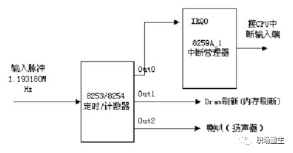
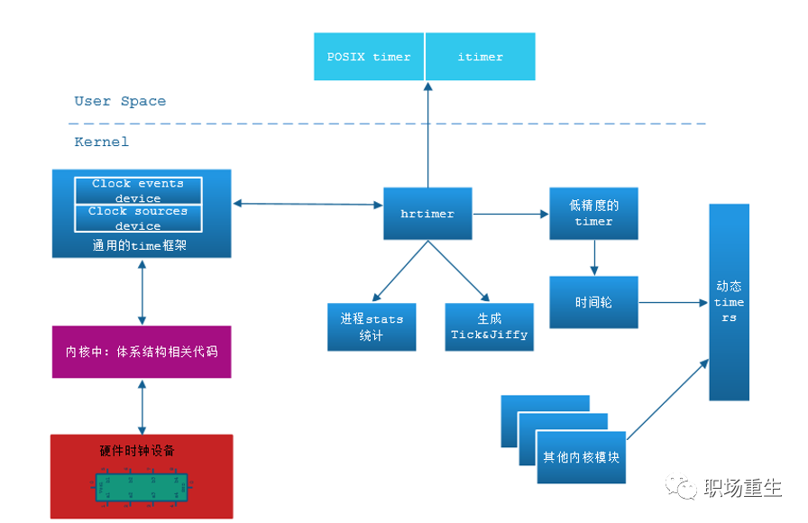
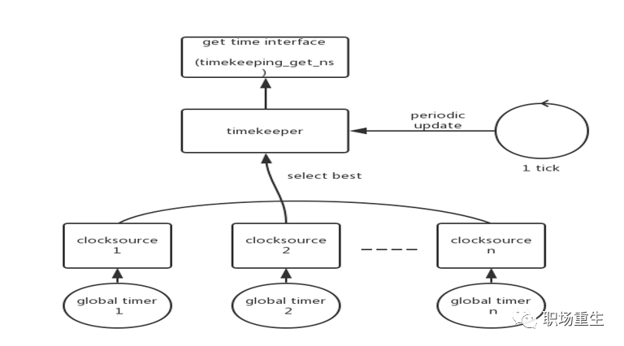
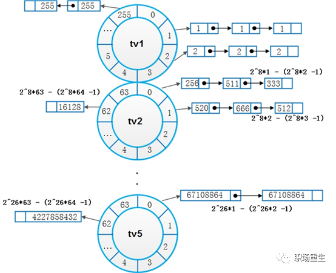
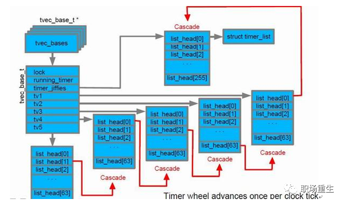
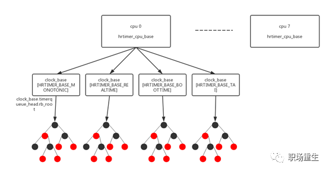

点击上方蓝字关注公众号，更多经典内容等着你

  

| 导语本文主要是讲Linux的调度系统, 由于全部内容太多，分三部分来讲，本篇是中篇（主要讲抢占和时钟），上篇请看（CPU和中断）：[Linux调度系统全景指南(上篇)](http://mp.weixin.qq.com/s?__biz=Mzg5NTU2MTg3Mw==&mid=2247485729&idx=1&sn=7093d908b7b6e94c18296eb74e5d5fe9&chksm=c00f30dff778b9c96fd31786022ab5a14ec918329c38f31a11fb022c7a5a0223658a94650b56&scene=21#wechat_redirect)，调度可以说是操作系统的灵魂，为了让CPU资源利用最大化，Linux设计了一套非常精细的调度系统，对大多数场景都进行了很多优化，系统扩展性强，我们可以根据业务模型和业务场景的特点，有针对性的去进行性能优化，在保证客户网络带宽前提下，隔离客户互相之间的干扰影响，提高CPU利用率，降低单位运算成本，提高市场竞争力。欢迎大家相互交流学习！

                              **目录**

上篇请看（CPU和中断）：[Linux调度系统全景指南(上篇)](http://mp.weixin.qq.com/s?__biz=Mzg5NTU2MTg3Mw==&mid=2247485729&idx=1&sn=7093d908b7b6e94c18296eb74e5d5fe9&chksm=c00f30dff778b9c96fd31786022ab5a14ec918329c38f31a11fb022c7a5a0223658a94650b56&scene=21#wechat_redirect)

                                   **抢占**

早期的Linux核心是不可抢占的。它的调度方法是：一个进程可以通过schedule()函数自愿地启动一次调度。非自愿的强制性调度只能发生在每次从系统调用返回的前夕，以及每次从中断或异常处理返回到用户空间的前夕。但是，如果在系统空间发生中断或异常是不会引起调度的。这种方式使内核实现得以简化。但常存在下面两个问题：

1.  如果这样的中断发生在内核中，本次中断返回是不会引起调度的，而要到最初使CPU从用户空间进入内核空间的那次系统调用或中断(异常)返回时才会发生调度。
    
2.  另外一个问题是优先级反转。在Linux中，在核心态运行的任何操作都要优先于用户态进程，这就有可能导致优先级反转问题的出现。例如，一个低优先级的用户进程由于执行软/硬中断等原因而导致一个高优先级的任务得不到及时响应。
    

当前的Linux内核加入了内核抢占(preempt)机制。内核抢占指用户程序在执行系统调用期间可以被抢占，该进程暂时挂起，使新唤醒的高优先级进程能够运行。这种抢占并非可以在内核中任意位置都能安全进行，比如在临界区中的代码就不能发生抢占。临界区是指同一时间内不可以有超过一个进程在其中执行的指令序列。在Linux内核中这些部分需要用自旋锁保护。

内核抢占要求内核中所有可能为一个以上进程共享的变量和数据结构就都要通过互斥机制加以保护，或者说都要放在临界区中。在抢占式内核中，认为如果内核不是在一个中断处理程序中，并且不在被 spinlock等互斥机制保护的临界代码中，就认为可以"安全"地进行进程切换。

Linux内核将临界代码都加了互斥机制进行保护，同时，还在运行时间过长的代码路径上插入调度检查点，打断过长的执行路径，这样，任务可快速切换进程状态，也为内核抢占做好了准备，抢占分为用户抢占和内核抢占，linux抢占发生的时机：

用户抢占在以下情况下产生：  

-   从系统调用返回用户空间
    
-   从中断处理程序返回用户空间
    

内核抢占会发生在：

-   当从中断处理程序返回内核空间的时候，且当时内核具有可抢占性；
    
-   当内核代码再一次具有可抢占性的时候（如:spin\_unlock时）；
    
-   如果内核中的任务显式的调用schedule()；
    
-   如果内核中的任务阻塞。
    

##                                   **时钟**

计算机最基本的时间单元是时钟周期，例如取指令、执行指令、存取内存等, CPU执行指令需求时钟来同步和推进。时间系统是计算机系统非常重要的组成部分，所有信息包括系统时间、进程的时间片、延时、使用CPU的时间、各种定时器，进程更新后的时间片为进程调度提供依据，也就是驱动进程的调度，任务调度与时钟的关系非常密切。

### **时钟芯片**

时钟芯片主要是提供时间源， 一般在一个计算机系统中存在三个时间发生器，一个用于记录日期时间的，它就是利用电池进行供电的一个单独芯片——RTC，第二个是PIT(可编程间隔定时器），第三个是TSC时间戳计数器，而PIT就是产生IRQ0的定时器芯片。而进行校正的就是利用TSC计数器，它在每个clock-cycle就会自动加一，不需要CPU操作，所以每个时钟中断产生时都可以利用一个全局变量记录下TSC的值，在下次时钟中断时再用这个全局变量校正jieffis的值，这样就可以记录精准的时间（TSC计数器是纳秒级的）。  

操作系统对可编程定时/计数器进行有关初始化，然后定时/计数器就对输入脉冲进行计数（分频），产生的三个输出脉冲Out0、Out1、Out2各有用途，很多书都介绍了这个问题，我们只看Out0上的输出脉冲，这个脉冲信号接到中断控制器8259A\_1的0号管脚，触发一个周期性的中断，我们就把这个中断叫做时钟中断，时钟中断的周期，也就是脉冲信号的周期，我们叫做“滴答”或“时标”（tick）。时钟与 CPU 和系统总线相关的每一个操作都是由一个恒定速率的内部时钟脉冲来进行同步的。机器指令的基本时间单位是机器周期 (machine cycle) 或时钟周期 (clock cycle)  。  

### **时钟中断**

“时钟中断”是特别重要的一个中断，因为整个操作系统的活动都受到它的激励。系统利用时钟中断维持系统时间、促使环境的切换，以保证所有进程共享CPU；利用时钟中断进行记帐、监督系统工作以及确定未来的调度优先级等工作。可以说，“时钟中断”是整个操作系统的脉搏。

从本质上来说，时钟中断只是一个周期性的信号，完全是硬件行为，该信号触发CPU去执行一个中断服务程序，在Linux的0号中断是一个时钟中断。在固定的时间间隔都发生一次中断，也就是说，每秒发生该中断的频率都是固定的。该频率是常量HZ，该值一般是在100 ~ 1000之间。该中断的作用是为了定时更新系统日期和时间，使系统时间不断地得到跳转。另外该中断的中断处理函数除了更新系统时间外，还需要更新本地CPU统计数。比如更新任务的调度时间片，若递减到0，则被调度出去而放弃CPU使用权。

### **时钟框架**

时钟芯片提供节拍（tick），Linux系统设计一套时钟软件系统，满足应用对时间的各种需求：比如时间片调度，系统时间，日期，定时器，睡眠等：

                           

**Linux时间系统实现**

内核对相关的时间硬件设备进行了统一的封装，定义了主要有下面两个结构：  

时钟源设备(closk source device)：抽象那些能够提供计时功能的系统硬件，比如 RTC(Real Time Clock)、TSC(Time Stamp Counter)，HPET，ACPI PM-Timer，PIT等。不同时钟源提供的精度不一样，现在pc大都支持高精度模式(high-resolution mode)，也支持低精度模式(low-resolution mode)。

时钟事件设备(clock event device)：系统中可以触发 one-shot（单次）或者周期性中断的设备都可以作为时钟事件设备。

**定时Timer**

这类timer每个cpu都有一个独立的，称为local timer。这类timer的中断一般都是PPI（Private Peripheral Interrupt）类型，即每个cpu都有独立一份中断。与PPI对应的是SPI（Shared Peripheral Interrupt，即多个cpu共享同一个中断。

这类timer一般是32bit宽度count，最重要的它会频繁的溢出并产生timer到期中断。

这类timer服务于tick timer(低精度)或者hrtimer(高精度)。

-   低精度模式，local timer工作在PERIODIC模式。即timer以tick时间(1/HZ)周期性的产生中断。在tick timer中处理任务调度tick、低精度timer、其他时间更新和统计profile。在这种模式下，所有利用时间的进行的运算，精度都是以tick(1/HZ)为单位的，精度较低。比如HZ=1000，那么tick=1ms。
    
-   高精度模式，local timer工作在ONESHOT模式。即系统可以支持hrtimer(high resolution)高精度timer，精度为local timer的计数clk达到ns级别。这种情况下把tick timer也转换成一种hrtimer。
    

**时间戳Timer**

-   这类timer一个系统多个cpu共享一个，称为global timer。
    
-   这类timer一般是32bit/64bit宽度count，一般不会溢出产生中断，系统实时的去读取count的值来计算当前的时间戳。
    
-   这类timer服务于clocksource/timekeeper。
    

timerwheel实现依赖基于系统tick周期性中断，高精度时钟定时器不在依赖系统的tick中断，而是基于事件触发，内核启动后会进行从低精度模式到高精度时钟模式的切换，hrtimer模拟的tick中断将驱动传统的低精度定时器系统（基于时间轮）和内核进程调度。

**低精度timer**

                           时间轮算法  

                              Linux 时间轮定时器  

-   Linux定时器时间轮分为5个级别的轮子(tv1 ~ tv5)，如图3所示。每个级别的轮子的刻度值(slot)不同，规律是次级轮子的slot等于上级轮子的slot之和。Linux定时器slot单位为1jiffy，tv1轮子分256个刻度，每个刻度大小为1jiffy。tv2轮子分64个刻度，每个刻度大小为256个jiffy，即tv1整个轮子所能表达的范围。相邻轮子也只有满足这个规律，才能达到“低刻度轮子转一圈，高刻度轮子走一格”的效果。tv3，tv4，tv5也都是分为64个刻度，因此容易算出，最高一级轮子tv5所能表达的slot范围达到了25664646464 = 2^32 jiffies。
    
-   基于时间轮 (Timing-Wheel) 方式实现的定时器， timer wheel只能支持ms级别的精度， 虽然大部分时间里，时间轮可以实现O(1)时间复杂度，但是当有进位发生时，不可预测的O(N)定时器级联迁移时间，这对于低分辨率定时器来说问题不大，可是它大大地影响了定时器的精度。低分辨率定时器几乎是为“超时”而设计的，并为此对它进行了大量的优化，对于这些以“超时”未目的而使用定时器，它们大多数期望在超时到来之前获得正确的结果，然后删除定时器，精确时间并不是它们主要的目的，例如网络通信、设备IO等等。
    

**高精度定时器Hrtimer**

-   hrtimer采用红黑树进行高精度定时器的管理， 通过将高精度时钟硬件的下次中断触发时间设置为红黑树中最早到期的 Timer 的时间，时钟到期后从红黑树中得到下一个 Timer 的到期时间，并设置硬件，如此循环反复。
    
-   在高精度时钟模式下，操作系统内核仍然需要周期性的tick中断，以便刷新内核的一些任务。前面可以知道， hrtimer是基于事件的，不会周期性出发tick中断，所以为了实现周期性的tick中断(dynamic tick)：系统创建了一个模拟 tick 时钟的特殊 hrtimer，将其超时时间设置为一个tick时长，在超时回来后，完成对应的工作，然后再次设置下一个tick的超时时间，以此达到周期性tick中断的需求。引入了dynamic tick，是为了能够在使用高精度时钟的同时节约能源,，这样在产生tickless 情况下，会跳过一些 tick。
    
